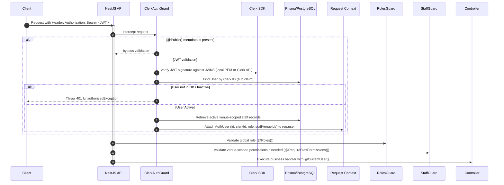
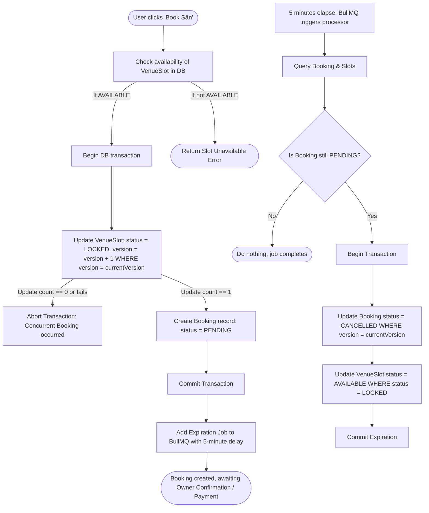

# Architecture & Engineering Analysis Report: DatSanVN

This document presents a comprehensive evaluation of the **DatSanVN** codebase from the perspective of a Senior Software Architect and Research Engineer. It outlines the project's purpose, design patterns, runtime pipelines, data flow paths, technical debt, and a roadmap for production readiness.

---

## 1. Overall Purpose of the Project

**DatSanVN** is a real-time sports venue booking platform (specialized for football/soccer fields) designed to connect sports players with venue owners.
* **For Players:** It acts as a search engine and reservation assistant, allowing them to locate sports venues, view real-time hourly slot availability, book slots, make payments, and write reviews.
* **For Venue Owners:** It provides a management dashboard to configure venues, manage fields, manage on-duty staff, confirm bookings, and monitor shift revenue.
* **For Administrators:** It acts as a gatekeeper to verify and approve venue ownership claims and moderate active venues across the platform.

---

## 2. Main Modules, Folders & Responsibilities

The codebase is built as a **monorepo** utilizing **Turborepo** and **pnpm workspaces**:

```
dat-san-vn/
├── apps/
│   ├── api/                   # NestJS Backend (REST APIs, BullMQ, Prisma)
│   │   ├── prisma/            # Database schema & migrations
│   │   └── src/               # Application Modules
│   │       ├── admin/         # Global admin management operations
│   │       ├── auth/          # Authentication & Clerk JWT verification
│   │       ├── booking/       # Booking lifecycle, logic, and transactions
│   │       ├── common/        # Shared guards, interceptors, filters, decorators
│   │       ├── config/        # Environment configurations (Redis, Clerk)
│   │       ├── field/         # Sports field sub-resource logic
│   │       ├── queues/        # Background queue jobs (booking-expiration via BullMQ)
│   │       ├── review/        # Ratings aggregation and eligibility checks
│   │       ├── staff/         # Venue-scoped staff permission management
│   │       ├── upload/        # Local disk image file uploading
│   │       ├── user/          # User profiles and global role sync
│   │       └── webhooks/      # Clerk User Sync Webhook handler
│   └── web/                   # Next.js 15 Frontend (App Router, Tailwind CSS, shadcn/ui)
│       ├── app/               # App Router pages and page layouts
│       ├── components/        # Reusable UI components grouped by feature area
│       ├── hooks/             # Custom React Hooks
│       └── lib/               # API clients (player, owner, admin) and utils
└── packages/
    ├── types/                 # Shared TypeScript interfaces, types, and enums (FE ↔ BE contract)
    └── utils/                 # Shared utility packages (currently a placeholder)
```

---

## 3. Data Flows & Execution Pipelines

### 3.1 Authentication & Request Context Pipeline
Every authenticated request undergoes the following lifecycle:


### 3.2 Booking Creation & Expiration Pipeline
Concurrently secure slot booking with optimistic locking and asynchronous release:


---

## 4. Incomplete Code, Technical Debt & Vulnerabilities

A deep-dive review of the code reveals several critical weaknesses:

1. **Incomplete Staff Walk-in Feature (`isWalkIn`)**
   * **Symptom:** In `booking.controller.ts`, the walk-in route calls `bookingService.createBooking` with `isWalkIn: true`.
   * **Root Cause:** In `booking.service.ts`, the parameter `CreateBookingDto` receives `isWalkIn`, but the service completely ignores it! It saves the booking with `status: 'PENDING'` and locks the slot as `'LOCKED'` under the 5-minute timer, rather than immediately confirming it (`status: 'CONFIRMED'`) and updating the slot to `'BOOKED'` via CASH payment as intended for walk-ins.
   * **Risk:** High. Staff cannot process offline walk-in bookings successfully; they will auto-expire after 5 minutes.

2. **Ephemeral File Storage (`diskStorage`)**
   * **Symptom:** `UploadController` (in [upload.controller.ts](file:///d:/Code_Ca_Nhan/dat-san-vn/apps/api/src/upload/upload.controller.ts)) uses Multer's `diskStorage` to save uploaded venue images directly into a local directory (`uploads/`).
   * **Root Cause:** Lack of Cloud Storage configuration.
   * **Risk:** High. Deploying the API in serverless environments (e.g., Vercel, AWS Lambda, Nixpacks containers) will result in uploaded images being deleted when instances recycle.

3. **Frontend API Client Fallback Weakness**
   * **Symptom:** In [api.ts](file:///d:/Code_Ca_Nhan/dat-san-vn/apps/api/src/api.ts), the `fetchApi` function intercepts connection failures and immediately returns mock data with a `200 OK` status and a logged message: *"Đang dùng mock data trong giai đoạn frontend core"*.
   * **Root Cause:** A placeholder mechanism designed to keep the UI interactive when the local API server was not running.
   * **Risk:** Medium. In staging or production, backend connection errors will be masked, returning stale mock values instead of letting the user interface properly handle and display error states.

4. **Optimistic Locking Ignored in Rating Aggregation**
   * **Symptom:** When creating a review in `ReviewService` ([review.service.ts](file:///d:/Code_Ca_Nhan/dat-san-vn/apps/api/src/review/review.service.ts)), the aggregate transaction updates the `Venue` average rating and count directly using `tx.venue.update` without taking the optimistic version field (`version`) into account or incrementing it.
   * **Root Cause:** Rating updates bypassing version checks.
   * **Risk:** Low-Medium. If an owner is modifying venue details concurrently with a player writing a review, the owner's update could either fail due to a version clash or overwrite the new average ratings.

5. **JSON-in-String Database Schema Columns**
   * **Symptom:** `images` and `amenities` fields are stored in the database as primitive array strings rather than normalized relationships or native JSONB fields.
   * **Root Cause:** Relational model design simplified as `String[]`.
   * **Risk:** Medium. Parsing invalid string inputs in the DB causes frequent `JSON.parse` crashes on the client, requiring defensive checks (`safeJsonParse` and `safeArray` wrappers) throughout the codebase.

---

## 5. System Mental Model

The system operates around three pillars:

```
    [CLERK AUTHENTICATION] 
             │ (Validates identity and synchronizes user profiles)
             ▼
     ┌───────────────┐        ┌───────────────┐
     │ PLAYER LAYER  │        │  OWNER LAYER  │
     └───────┬───────┘        └───────┬───────┘
             │ (Books slot)           │ (Confirms booking / Sets staff)
             ▼                        ▼
      [ NestJS API Gateway - Clerk & Roles Guards ]
             │
             ├─► [Prisma Concurrency Control] ──► [PostgreSQL Database]
             │   (Optimistic Locking via version tracking)
             │
             └─► [BullMQ / Redis Scheduler]
                 (Enforces 5-minute unpaid booking expiration)
```

1. **State Ownership:** Every core action requires matching identity. Owners control venues and fields; staff act within granted permissions; players reserve individual slots.
2. **Concurrency Safety:** Slots cannot be double-booked. We use database-level optimistic version checks (`version` fields) to reject overlapping writes cleanly, avoiding heavy pessimistic row-locking delays.
3. **Automatic Cleanup:** BullMQ handles the booking state machine scheduler asynchronously. If money or confirmation does not arrive, the queue unlocks the resources.

---

## 6. Critical Files to Understand

If you need to understand the project rapidly, study these files:
* **Database & Relations:** [schema.prisma](file:///d:/Code_Ca_Nhan/dat-san-vn/apps/api/prisma/schema.prisma) — Defines the core entity structures, indexing strategy, and states.
* **Concurrency Locking Engine:** [booking.service.ts](file:///d:/Code_Ca_Nhan/dat-san-vn/apps/api/src/booking/booking.service.ts) and [optimistic-lock.guard.ts](file:///d:/Code_Ca_Nhan/dat-san-vn/apps/api/src/common/optimistic-lock.guard.ts) — Controls the booking transaction safety and optimistic locking logic.
* **Security & Context:** [clerk-auth.guard.ts](file:///d:/Code_Ca_Nhan/dat-san-vn/apps/api/src/auth/guards/clerk-auth.guard.ts) and [staff.guard.ts](file:///d:/Code_Ca_Nhan/dat-san-vn/apps/api/src/common/guards/staff.guard.ts) — Decouples system role authorization from venue-scoped staff authorization.
* **Frontend-Backend Integration:** [owner-api.ts](file:///d:/Code_Ca_Nhan/dat-san-vn/apps/api/src/owner-api.ts) and [types/src/index.ts](file:///d:/Code_Ca_Nhan/packages/types/src/index.ts) — Shows how payloads, types, and APIs match.

---

## 7. Stage of Development & Next Steps

### Current Stage: Stable MVP / Demo
The core booking logic, user authentication webhook integration, venue configuration, reviews, and admin dashboard tables are implemented. Concurrency safety is operational. 

### Prioritized Roadmap for Release

```mermaid
gantt
    title Roadmap to Production Release
    dateFormat  X
    axisFormat %d
    
    section High Priority
    Implement S3/Supabase Cloud Storage     :active, p1, 0, 3
    Fix Staff Walk-in `isWalkIn` Service Bug :active, p2, 1, 4
    Remove Frontend Client Mock Fallback    :active, p3, 2, 5
    
    section Medium Priority
    Integrate Payment Gateway (MoMo/VNPAY)  :p4, 4, 9
    Clean and Migrate Schema array columns  :p5, 6, 11
    
    section Low Priority
    Polish Mobile UX for Owner Dashboard    :p6, 10, 14
```



1. **[High] Replace Local Disk Storage:** Refactor `UploadModule` to upload directly to Supabase Storage or AWS S3.
2. **[High] Fix Staff Walk-in Logic:** Update `BookingService.createBooking` to check `dto.isWalkIn` and mark the booking `CONFIRMED` and slot `BOOKED` instantly, bypassing the 5-minute expiration queue.
3. **[High] Remove Frontend API Fallbacks:** Remove mock fallbacks in frontend API fetch utilities (`api.ts`), ensuring backend connection failures correctly propagate error states to the UI.
4. **[Medium] Integrate Payment Gateway:** Implement the Momopay or VNPAY webhook integrations to toggle booking states from `PENDING` to `CONFIRMED`.
5. **[Medium] Refactor Schema Column Arrays:** Convert `String[]` arrays (`images`, `amenities`) to JSONB format or related tables to avoid JSON parsing runtime failures.
6. **[Low] Polish Mobile Layouts:** Adapt the complex administrative tables in `/owner` and `/admin` for mobile responsiveness.
