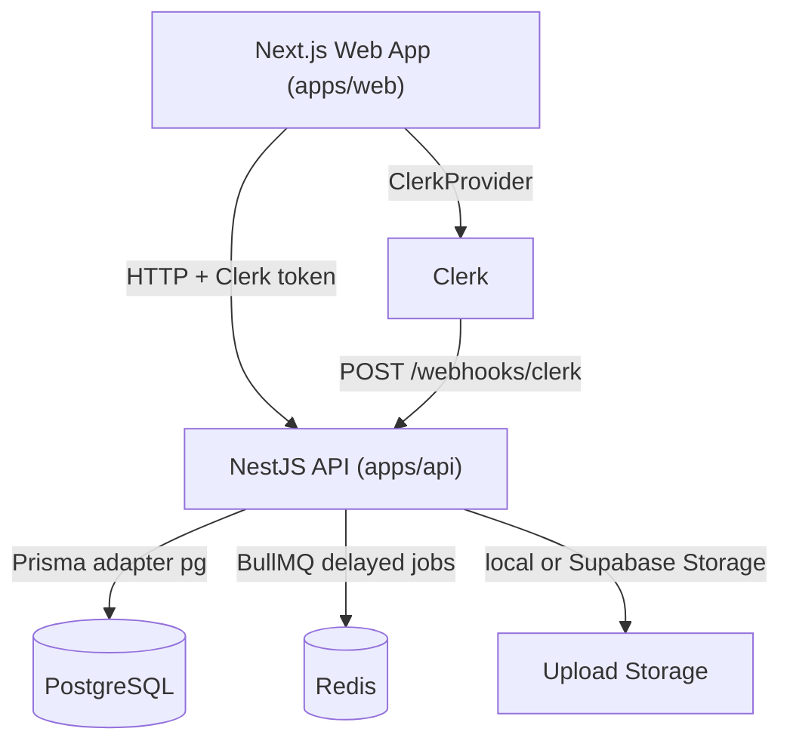
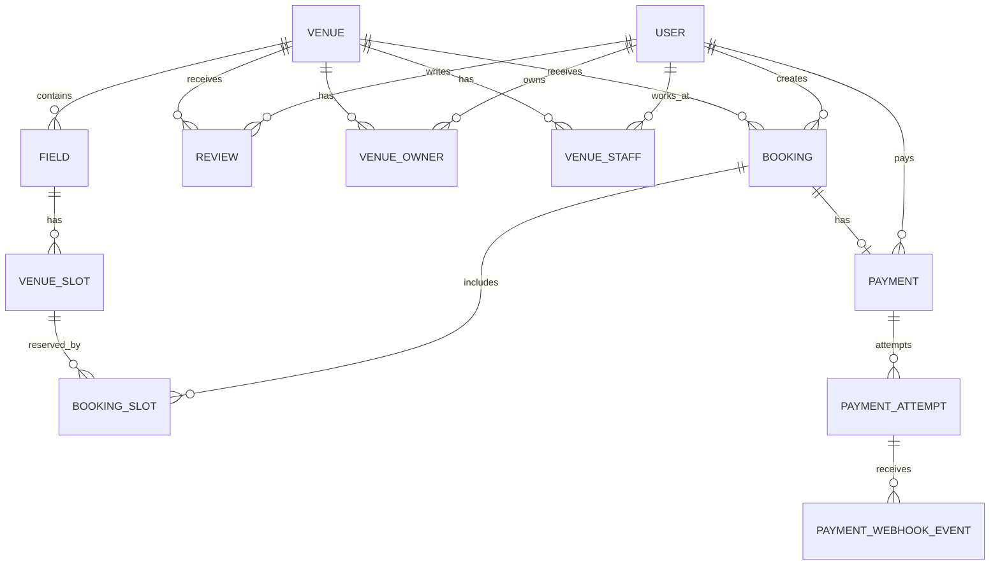

# BAO CAO TONG QUAN TOAN BO DU AN DATSANVN

> Phien ban nay da duoc doi chieu voi ma nguon trong repository `D:\Code_Ca_Nhan\dat-san-vn`. Cac khang dinh chinh ben duoi deu gan voi file bang chung cu the. Nhung phan chua duoc trien khai ro rang duoc ghi nhan la "Prototype", "Một phần", "Đã thiết kế nền tảng" hoac "Chưa triển khai đầy đủ".

## 1. Thong tin chung

* **Ten du an:** DatSanVN - nen tang dat san the thao truc tuyen.
* **Muc tieu:** so hoa quy trinh tim san, dat san, quan ly san, duyet san, quan ly booking va doi soat van hanh cho cac cum san the thao.
* **Doi tuong su dung:** Player, Owner, Admin; ngoai ra schema va backend da co nen tang `VenueStaff` cho nhan vien theo tung venue.
* **Pham vi hien tai:** Web App/Web Admin va Backend API la phan trien khai chinh. Khong tim thay native Mobile App trong repository.

## 2. Phien ban cong nghe da xac minh

Bang duoi lay tu `package.json` va ket qua `pnpm list` trong workspace, khong suy doan theo ten framework.

| Thanh phan | Phien ban xac minh | Bang chung |
| --- | --- | --- |
| pnpm workspace | `pnpm@9.0.0` | `package.json` |
| Turborepo | `2.9.5` | `package.json`, `turbo.json` |
| TypeScript root/web/api | `5.9.2` | `package.json`, `apps/web/package.json`, `pnpm --filter api list typescript` |
| Next.js | `16.2.0` | `apps/web/package.json` |
| React / React DOM | `19.2.0` / `19.2.0` | `apps/web/package.json` |
| Clerk frontend | `@clerk/nextjs 7.2.3` | `apps/web/package.json` |
| NestJS core/common | `@nestjs/core 11.1.18`, `@nestjs/common 11.1.18` | `pnpm --filter api list @nestjs/core @nestjs/common` |
| NestJS BullMQ | `@nestjs/bullmq 11.0.4` | `apps/api/package.json` |
| Prisma CLI/client | `prisma 7.7.0`, `@prisma/client 7.7.0`, `@prisma/adapter-pg 7.7.0` | `apps/api/package.json` |
| BullMQ | `5.73.5` | `apps/api/package.json` |
| Redis client | `ioredis 5.10.1` | `apps/api/package.json` |
| Clerk backend | `@clerk/backend 3.2.8` | `apps/api/package.json` |

Luu y sua sai so voi report sinh tu dong: frontend dang dung **Next.js 16.2.0**, khong phai Next.js 15.

## 3. Tong quan kien truc

Repository la monorepo pnpm/Turborepo:

* `apps/web`: Next.js App Router, React, TypeScript, Tailwind CSS, Clerk UI/Auth, cac component UI noi bo theo phong cach shadcn.
* `apps/api`: NestJS API, Prisma ORM, PostgreSQL, Clerk JWT/webhook, BullMQ + Redis, upload local/Supabase Storage, payment sandbox/prototype.
* `packages/types`: package type dung chung.
* `packages/typescript-config`: cau hinh TypeScript dung chung.
* `docker-compose.yml`: dich vu local PostgreSQL 16 va Redis 7.

Bang chung: `package.json`, `pnpm-workspace.yaml`, `turbo.json`, `docker-compose.yml`, `apps/web/package.json`, `apps/api/package.json`.



## 4. Pham vi mobile

Khong tim thay React Native, Expo, Flutter, Android/iOS native project, `pubspec.yaml`, `metro.config`, `android/` hoac `ios/` app trong repo. Phan frontend hien tai la responsive web UI tren Next.js.

**Ket luan can ghi trong bao cao:** "Phân hệ Mobile App hiện được đặc tả ở mức UI/UX prototype hoặc định hướng mở rộng; phần triển khai chính hiện tại tập trung vào Web App/Web Admin và Backend API."

Bang chung: `apps/web/app/layout.tsx`, `apps/web/app/(main)/*`, ket qua search khong co Expo/React Native/Flutter markers.

## 5. Backend API da xac minh

API co global prefix `/api`, ngoai tru `GET /health`, Clerk webhook `/webhooks/clerk`, va static uploads. Bang chung: `apps/api/src/main.ts`, `apps/api/src/app.controller.ts`.

| Module | Endpoint/hanh vi chinh | Trang thai | Bang chung |
| --- | --- | --- | --- |
| Health | `GET /health`; root controller co `GET /api` | Verified | `apps/api/src/app.controller.ts` |
| Auth | Clerk JWT guard, public decorator, current user decorator | Verified | `apps/api/src/auth/guards/clerk-auth.guard.ts`, `apps/api/src/auth/auth.module.ts` |
| Clerk webhook | `POST /webhooks/clerk`, Svix raw body verification | Verified | `apps/api/src/webhooks/clerk/clerk-webhook.controller.ts`, `apps/api/src/webhooks/clerk/clerk-webhook.service.ts` |
| Users | `GET /api/users`, `GET /api/users/me`, `GET/PATCH/DELETE /api/users/:id` | Verified | `apps/api/src/user/user.controller.ts` |
| Venues | `POST /api/venues`, `GET /api/venues`, `GET /api/venues/featured`, `GET /api/venues/my`, `GET/PATCH/DELETE /api/venues/:id`, ownership request/approve/reject | Verified | `apps/api/src/venue/venue.controller.ts` |
| Fields/slots | `POST/GET /api/venues/:venueId/fields`, `GET/PATCH/DELETE /api/fields/:id`, `GET /api/fields/:id/slots` | Verified | `apps/api/src/field/field.controller.ts` |
| Bookings | `POST /api/bookings`, `GET /api/bookings/me`, `GET /api/bookings`, confirm/cancel aliases, staff confirm/cancel, `POST /api/bookings/walk-in` | Verified | `apps/api/src/booking/booking.controller.ts` |
| Payments | `POST /api/payments`, `GET /api/payments/booking/:bookingId/status`, `POST /api/payments/webhooks/:provider` | Sandbox/prototype | `apps/api/src/payment/payment.controller.ts` |
| Reviews | `POST /api/reviews`, `GET /api/reviews/eligibility`, `GET /api/reviews/venue/:venueId` | Verified | `apps/api/src/review/review.controller.ts` |
| Upload | `POST /api/upload`, OWNER/ADMIN, memory upload, type sniffing, max 5 MB, local/Supabase storage | Verified | `apps/api/src/upload/upload.controller.ts`, `apps/api/src/upload/upload-storage.service.ts` |
| Admin | `GET /api/admin/stats`, users, venues approve/reject, bookings | Verified | `apps/api/src/admin/admin.controller.ts` |
| Staff | `GET/POST/PATCH/DELETE /api/venues/:venueId/staff`, shift revenue | Một phần | `apps/api/src/staff/staff.controller.ts` |
| Queues/workers | BullMQ queue `booking-expiration`, worker auto-cancel PENDING bookings | Verified | `apps/api/src/queues/booking-expiration/*` |

## 6. Xac thuc va phan quyen

* Clerk duoc tich hop o frontend qua `ClerkProvider` va route sign-in/sign-up: `apps/web/app/layout.tsx`, `apps/web/app/(auth)/sign-in/[[...sign-in]]/page.tsx`, `apps/web/app/(auth)/sign-up/[[...sign-up]]/page.tsx`.
* Backend xac thuc JWT bang `verifyToken()` tu `@clerk/backend`, sau do tra user tu DB theo `clerkId`: `apps/api/src/auth/guards/clerk-auth.guard.ts`.
* Role enum thuc te la `PLAYER`, `OWNER`, `ADMIN`; khong co role `USER`: `apps/api/prisma/schema.prisma`.
* `RolesGuard` va `@Roles()` bao ve route theo role; `StaffGuard` kiem tra owner/staff theo venue va `StaffPermission`: `apps/api/src/common/guards/roles.guard.ts`, `apps/api/src/common/guards/staff.guard.ts`.

## 7. Booking timeout va conflict prevention

### Timeout thuc te

Code backend dung **5 phut** lam timeout mac dinh cho booking moi:

* `BookingExpirationService` doc env `PAYMENT_HOLD_MINUTES`, fallback `5`, va tinh `delayMs = minutes * 60 * 1000`: `apps/api/src/queues/booking-expiration/booking-expiration.service.ts`.
* Khi tao booking thuong, `BookingService` set `expiresAt = bookingExpirationService.getExpirationDate()` va add BullMQ delayed job theo `booking.expiresAt`: `apps/api/src/booking/booking.service.ts`.
* Worker xu ly job `booking-expiration`; neu booking van `PENDING` va payment chua `PAID`, cap nhat booking sang `CANCELLED` va release slot `LOCKED` ve `AVAILABLE`: `apps/api/src/queues/booking-expiration/booking-expiration.processor.ts`.
* Frontend mock booking/payment countdown cung tao `expiresAt` bang `PAYMENT_HOLD_TIMEOUT_MS` 300000 ms: `apps/web/lib/payment-hold.ts`, `apps/web/lib/player-booking-api.ts`, `apps/web/components/booking/booking-sheet.tsx`.

Luu y ky thuat: `PaymentService.resolveAttemptExpiresAt()` fallback theo `PAYMENT_HOLD_MINUTES` mac dinh 5 phut khi booking khong co `expiresAt`, nen timeout booking hien hanh la **5 phut**.

### Conflict prevention

* Booking tao moi lock slot bang transaction va `venueSlot.updateMany({ where: { id, status: 'AVAILABLE' }, data: { status: 'LOCKED', version: { increment: 1 }}})`: `apps/api/src/booking/booking.service.ts`.
* Confirm/cancel dung `version` va `status` guard khi update booking/slot: `apps/api/src/booking/booking.service.ts`.
* Optimistic locking helper va `assertOptimisticUpdate()` nam tai `apps/api/src/common/optimistic-lock.guard.ts`.
* Schema co `version` tren `Venue`, `Field`, `VenueSlot`, `Booking`, `Payment`: `apps/api/prisma/schema.prisma`.
* Migration rieng them optimistic locking cho `bookings`, `fields`, `venues`, `venue_slots`: `apps/api/prisma/migrations/20260429090000_add_optimistic_locking/migration.sql`.

Khong nen mo ta rang co Redis key lock TTL rieng cho tung slot. Redis/BullMQ duoc dung cho delayed expiration va idempotency; slot lock chinh duoc luu trong DB qua `VenueSlot.status = LOCKED`.

## 8. Thanh toan

**Phan loai dung:** **Sandbox/prototype**.

Chi tiet:

* Schema da co `Payment`, `PaymentAttempt`, `PaymentWebhookEvent`, payment enums va indexes: `apps/api/prisma/schema.prisma`, migration `20260527090000_add_payment_foundation`.
* `POST /api/payments` tao payment attempt, goi provider registry, luu `paymentUrl`, set payment/attempt ve `PENDING`/`PROCESSING`: `apps/api/src/payment/payment.service.ts`.
* MoMo sandbox co request body, HMAC signature, HTTP POST toi sandbox endpoint, parse `payUrl/deeplink/qrCodeUrl`: `apps/api/src/payment/providers/momo-payment.provider.ts`.
* MoMo IPN co verify signature, kiem tra partner/order/amount, luu webhook event, va khi thanh cong thi set `PaymentAttempt=PAID`, `Payment=PAID`, `Booking=CONFIRMED`, `VenueSlot=BOOKED`: `apps/api/src/payment/payment.service.ts`.
* VNPay chi tao sandbox URL gia lap va `verifyWebhook()` nem `NotImplementedException`: `apps/api/src/payment/providers/vnpay-payment.provider.ts`.
* Controller chi cho process webhook provider `MOMO`; provider khac bi `NotImplementedException`: `apps/api/src/payment/payment.controller.ts`.
* Local mock provider ton tai cho moi truong dev, nhung webhook mock chua xu ly: `apps/api/src/payment/providers/mock-payment.provider.ts`.

Do do khong duoc ghi "MoMo/VNPay production integration hoan thanh". Cach ghi chinh xac: "Đã thiết kế nền tảng thanh toan va co MoMo sandbox/prototype voi IPN/status transition; VNPay moi o muc sandbox URL stub, chua co webhook verification."

## 9. Frontend Web da xac minh

Routes App Router:

| Route | Trang thai | Bang chung |
| --- | --- | --- |
| `/` | Homepage/main page | `apps/web/app/(main)/page.tsx` |
| `/search` | Tim kiem venue | `apps/web/app/(main)/search/page.tsx` |
| `/venues/[id]` | Chi tiet venue, gallery, booking sheet, reviews | `apps/web/app/(main)/venues/[id]/page.tsx` |
| `/bookings` | Lich su booking cua player | `apps/web/app/(main)/bookings/page.tsx` |
| `/payments/return` | Man hinh return/polling sau payment | `apps/web/app/(main)/payments/return/page.tsx` |
| `/owner` | Owner dashboard; co fallback mock trong dev/empty data | `apps/web/app/(main)/owner/page.tsx` |
| `/owner/bookings` | Owner booking management; co mock fallback | `apps/web/app/(main)/owner/bookings/page.tsx` |
| `/owner/venues` | Owner venue CRUD UI | `apps/web/app/(main)/owner/venues/page.tsx` |
| `/owner/venues/[id]/fields` | Owner field CRUD UI | `apps/web/app/(main)/owner/venues/[id]/fields/page.tsx` |
| `/admin` | Admin stats | `apps/web/app/(main)/admin/page.tsx` |
| `/admin/users` | Admin user table/actions | `apps/web/app/(main)/admin/users/page.tsx` |
| `/admin/venues` | Admin venue approval | `apps/web/app/(main)/admin/venues/page.tsx` |
| `/admin/bookings` | Admin booking read-only table | `apps/web/app/(main)/admin/bookings/page.tsx` |
| `/sign-in`, `/sign-up` | Clerk UI | `apps/web/app/(auth)/sign-in/[[...sign-in]]/page.tsx`, `apps/web/app/(auth)/sign-up/[[...sign-up]]/page.tsx` |

Component nhom chinh:

* Venue/search: `apps/web/components/venue/*`
* Booking/payment countdown: `apps/web/components/booking/*`
* Owner UI: `apps/web/components/owner/*`
* Admin UI: `apps/web/components/admin/*`
* Reviews: `apps/web/components/review/*`
* Upload/common/layout/ui: `apps/web/components/common/*`, `apps/web/components/layout/*`, `apps/web/components/ui/*`

Can ghi ro: owner dashboard/bookings co fallback mock UI trong mot so truong hop (`owner-dashboard-mock-client.tsx`, `owner-bookings-mock-client.tsx`, `mock-owner-bookings.ts`), nen khong nen goi toan bo owner realtime dashboard la hoan chinh san xuat.

## 10. Thiet ke co so du lieu

Datasource Prisma la PostgreSQL: `apps/api/prisma/schema.prisma`. Prisma 7 config dung `DIRECT_URL` cho CLI/migrations va runtime `DATABASE_URL` qua adapter pg trong service: `apps/api/prisma.config.ts`, `apps/api/src/prisma/prisma.service.ts`.

### Models chinh

| Model | Vai tro |
| --- | --- |
| `User` | User dong bo tu Clerk, role, active status, relations toi booking/payment/review/staff |
| `Venue` | Cum san, dia chi, toa do, anh, tien ich, gia, rating, soft delete, active approval |
| `Field` | San con thuoc venue, sport type, size, active |
| `VenueOwner` | Quan he owner-venue va trang thai duyet `PENDING/APPROVED/REJECTED` |
| `VenueSlot` | Khung gio cua field, `AVAILABLE/LOCKED/BOOKED`, gia slot |
| `Booking` | Luot dat san, status, totalPrice, cancel/refund, `expiresAt`, version |
| `BookingSlot` | Bang noi booking voi venue slot; unique theo `(bookingId, venueSlotId)` |
| `Payment` | Aggregate thanh toan gan 1-1 voi booking |
| `PaymentAttempt` | Lan khoi tao thanh toan theo provider, provider order/request id |
| `PaymentWebhookEvent` | Su kien webhook/IPN, payload hash, signature status, processing status |
| `Review` | Rating/comment cua user cho venue, co the gan booking |
| `VenueStaff` | Staff theo venue, permissions dang enum array |

### Enums quan trong

`UserRole`, `VenueOwnerStatus`, `SportType`, `FieldSize`, `SlotStatus`, `BookingStatus`, `PaymentStatus`, `PaymentMethod`, `PaymentProvider`, `PaymentAttemptStatus`, `PaymentWebhookProcessingStatus`, `StaffPermission`.

### Constraints/indexes dang chu y

* Unique: `User.clerkId`, `User.email`, `VenueOwner(userId, venueId)`, `BookingSlot(bookingId, venueSlotId)`, `Payment.bookingId`, `PaymentAttempt.providerOrderId`, `PaymentAttempt.providerRequestId`, `PaymentWebhookEvent.payloadHash`, `VenueStaff(venueId, userId)`.
* Indexes: `Venue(city, district)`, `Venue(isActive)`, `Field(venueId)`, `Field(sportType)`, `VenueSlot(fieldId, date)`, `VenueSlot(fieldId, date, startTime)`, `VenueSlot(fieldId, date, status)`, `Booking(userId, status)`, `Booking(venueId, status)`, payment/provider/status indexes, review indexes.
* Optimistic locking fields: `version` tren `Venue`, `Field`, `VenueSlot`, `Booking`, `Payment`.



## 11. Danh gia muc do hoan thien

| Hang muc | Trang thai da audit | Bang chung | Ghi chu |
| --- | --- | --- | --- |
| Monorepo/pnpm/Turborepo | Verified | `package.json`, `pnpm-workspace.yaml`, `turbo.json` | Workspace ro rang |
| Next.js Web | Verified | `apps/web/package.json`, `apps/web/app/*` | Next.js 16.2.0 |
| NestJS API | Verified | `apps/api/package.json`, `apps/api/src/app.module.ts` | NestJS 11.x |
| Prisma/PostgreSQL | Verified | `apps/api/prisma/schema.prisma`, `prisma.config.ts` | Prisma 7.7.0 |
| Clerk auth | Verified | `apps/api/src/auth`, `apps/web/app/layout.tsx` | Auth + webhook sync |
| Role-based access | Verified | `RolesGuard`, `StaffGuard`, controllers | Role thuc te: PLAYER/OWNER/ADMIN |
| Venue/Field CRUD | Verified | `venue.controller.ts`, `field.controller.ts` | Owner/admin guard |
| Slot availability | Verified | `field.service.ts`, `booking.service.ts` | DB status AVAILABLE/LOCKED/BOOKED |
| Booking creation | Verified | `booking.service.ts` | Transaction + idempotency |
| Booking timeout rollback | Verified | `booking-expiration.service.ts`, `booking-expiration.processor.ts` | Default 5 phut |
| Payment | Sandbox/prototype | `apps/api/src/payment/*` | MoMo sandbox co IPN; VNPay chua verify webhook |
| Review system | Verified | `review.controller.ts`, `review.service.ts` | Co API va UI section; UI co fallback mock reviews |
| Admin dashboard | Verified | `apps/web/app/(main)/admin/*`, `admin.controller.ts` | Web + API |
| Owner dashboard | Một phần | `apps/web/app/(main)/owner/*`, `components/owner/*` | Co real API + mock fallback |
| Mobile app | Chưa triển khai đầy đủ | Khong co RN/Expo/Flutter markers | Chi responsive web |
| Real-time dashboard | Not found | Khong co WebSocket/Socket.io module | Can ghi la chua trien khai |
| Docker local services | Verified | `docker-compose.yml` | Postgres + Redis |
| Seed scripts | Verified | `apps/api/scripts/seed-demo-data.ts`, `seed-clerk-users.ts` | Co script, chua duoc chay trong audit |
| Test scripts | Một phần | `apps/api/package.json` | Jest config co, khong thay bang chung coverage day du |

## 12. Huong dan chay local an toan

Khong dua gia tri secret vao bao cao. Chi liet ke ten bien can cau hinh: `DATABASE_URL`, `DIRECT_URL`, `CLERK_WEBHOOK_SECRET`, `CLERK_SECRET_KEY`, `CLERK_PUBLISHABLE_KEY`, `REDIS_URL` hoac `REDIS_HOST`, `PAYMENT_HOLD_MINUTES`, `PAYMENT_*`, `MOMO_*`, `VNPAY_*`, `SUPABASE_*` neu dung upload Supabase.

Lenh nen chay thu cong:

```powershell
pnpm install
docker-compose up -d
pnpm --filter api exec prisma generate
pnpm --filter api run db:seed:demo
pnpm dev
pnpm --filter api test
pnpm --filter web check-types
pnpm --filter api build
pnpm --filter web build
```

Khong nen chay migration/db push khi chi audit tai lieu, tru khi nguoi phu trach DB xac nhan moi truong an toan.

## 13. Cac sua doi quan trong so voi report sinh tu dong

1. Doi Next.js tu 15 thanh **16.2.0**.
2. Timeout booking la **5 phut** theo `BookingExpirationService` va `PaymentService`; fallback payment cung mac dinh 5 phut khi booking cu/null `expiresAt`.
3. Doi payment tu "schema only/chua goi API" thanh **Sandbox/prototype**: MoMo sandbox co API call va webhook status transition; VNPay chua webhook verification.
4. Doi role `USER` thanh `PLAYER`.
5. Lam ro khong co native Mobile App; chi co responsive web/mobile UI prototype/dinh huong.
6. Lam ro slot lock khong phai Redis key TTL rieng, ma la DB `VenueSlot.status = LOCKED` + BullMQ expiration.
7. Bo claim realtime dashboard hoan chinh; hien chua tim thay WebSocket/Socket.io.

## 14. Ket luan

DatSanVN da co nen tang web/backend kha day du cho dat san: auth Clerk, CRUD venue/field, slot availability, booking transaction, optimistic locking, BullMQ expiration, admin/owner UI va payment sandbox/prototype. Nhung de nop bao cao chinh xac, can tranh mo ta cac phan sau la hoan thanh san xuat: Native Mobile App, realtime dashboard, VNPay webhook/production payment, va owner dashboard realtime. Cac phan nay nen duoc ghi la prototype, mot phan, da thiet ke nen tang hoac chua trien khai day du.
